---
## Front matter
title: "Отчёт по лабораторной работе №1"
subtitle: "Установка и конфигурация операционной системы на виртуальную машину"
author: "Касакьянц Владислав Сергеевич"

## Generic otions
lang: ru-RU
toc-title: "Содержание"

## Bibliography
bibliography: bib/cite.bib
csl: pandoc/csl/gost-r-7-0-5-2008-numeric.csl

## Pdf output format
toc: true # Table of contents
toc-depth: 2
lof: true # List of figures
lot: true # List of tables
fontsize: 12pt
linestretch: 1.5
papersize: a4
documentclass: scrreprt
## I18n polyglossia
polyglossia-lang:
  name: russian
  options:
	- spelling=modern
	- babelshorthands=true
polyglossia-otherlangs:
  name: english
## I18n babel
babel-lang: russian
babel-otherlangs: english
## Fonts
mainfont: PT Serif
romanfont: PT Serif
sansfont: PT Sans
monofont: PT Mono
mainfontoptions: Ligatures=TeX
romanfontoptions: Ligatures=TeX
sansfontoptions: Ligatures=TeX,Scale=MatchLowercase
monofontoptions: Scale=MatchLowercase,Scale=0.9
## Biblatex
biblatex: true
biblio-style: "gost-numeric"
biblatexoptions:
  - parentracker=true
  - backend=biber
  - hyperref=auto
  - language=auto
  - autolang=other*
  - citestyle=gost-numeric
## Pandoc-crossref LaTeX customization
figureTitle: "Рис."
tableTitle: "Таблица"
listingTitle: "Листинг"
lofTitle: "Список иллюстраций"
lotTitle: "Список таблиц"
lolTitle: "Листинги"
## Misc options
indent: true
header-includes:
  - \usepackage{indentfirst}
  - \usepackage{float} # keep figures where there are in the text
  - \floatplacement{figure}{H} # keep figures where there are in the text
---

# Цель работы

Целью данной работы является приобретение практических навыков установки операционной системы на виртуальную машину, настройки минимально необходимых для дальнейшей работы сервисов.

# Задание

1. Установить виртуальную машину;
2. Установить на неё дистрибутив Fedora Linux;
3. Настроить операционную систему для дальнейшей работы;
4. С помощью команды dmesg получить необходимую информацию: версию ядра Linux, частоту и модель процессора, объём доступной памяти, обнаруженный гипервизор, тип файловой системы корневого раздела, последовательность монтирования файловых систем.

# Теоретическое введение

Операционная система — это комплекс взаимосвязанных программ, который действует как интерфейс между приложениями и пользователями с одной стороны и аппаратурой компьютера, с другой стороны.

VirtualBox – это специальное средство для виртуализации, позволяющее запускать операционную систему внутри другой. С помощью VirtualBox мы можем не только запускать ОС, но и настраивать сеть, обмениваться файлами и делать многое другое.

# Выполнение лабораторной работы

Для начала создадим новую виртуальную машину: в программе VirtualBox нажимаем на кнопку «создать», в качестве имени указываем логин в дисплейном классе (vskasakjyanc) и выбираем образ операционной системы Linux (дистрибутив Fedora WorkStation) (рис. [-@fig:001]).

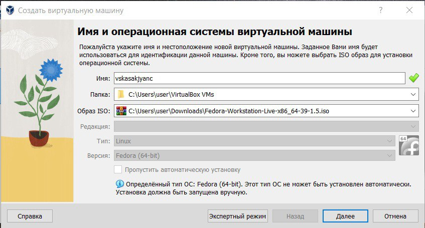{#fig:001 width=70%}

Выставляем нужный объем основной памяти и количество процессоров (рис. [-@fig:002]). После указываем размер диска (рис. [-@fig:003]).

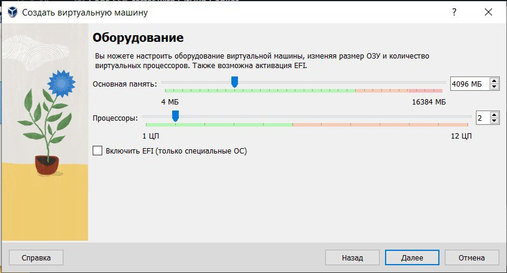{#fig:002 width=70%}

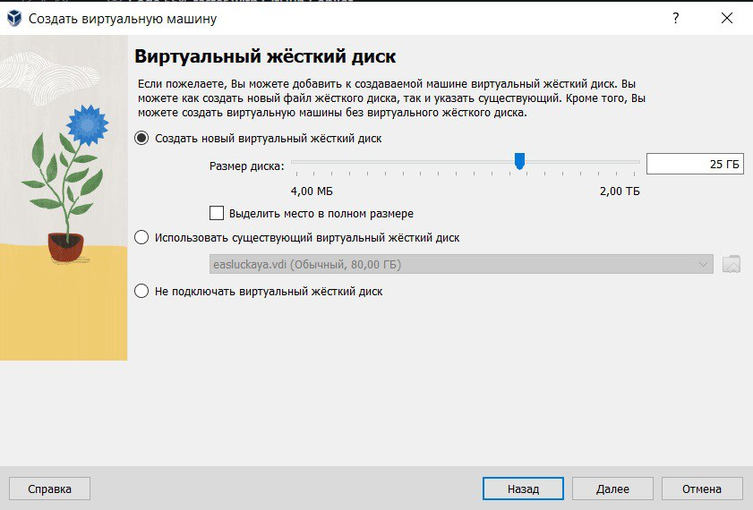{#fig:003 width=70%}

Итоговую, на данный момент, конфигурацию системы можно увидеть ниже (рис. [-@fig:004])

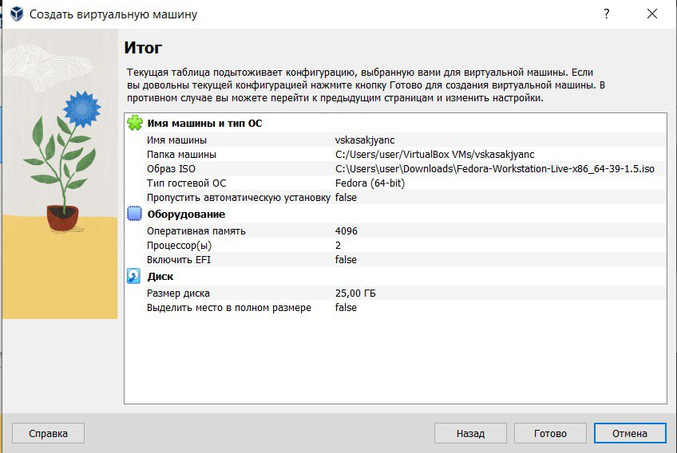{#fig:004 width=70%}

Запустим созданную ранее виртуальную машину. Нас встретит меню загрузчика GRUB. Из предложенных вариантов выберем первое (рис. [-@fig:005])

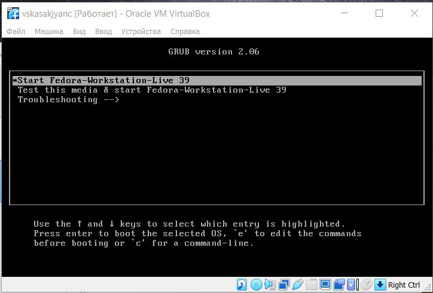{#fig:005 width=70%}

После загрузки системы появится окно с предложением установки ОС Fedora, нажмем на кнопку Install Fedora (рис. [-@fig:006]).

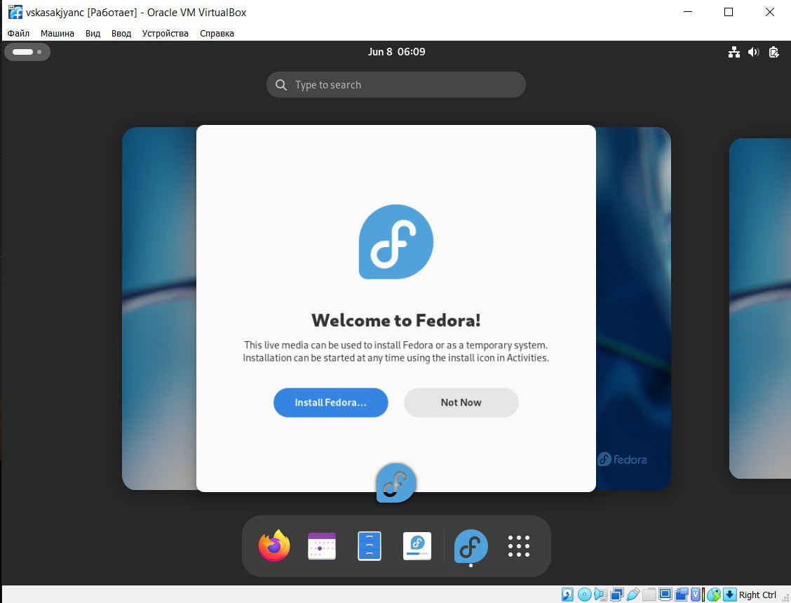{#fig:006 width=70%}

Выбираем язык (рис. [-@fig:007]) и место установки (рис. [-@fig:008]), после  кликаем на кнопку Начать установку.

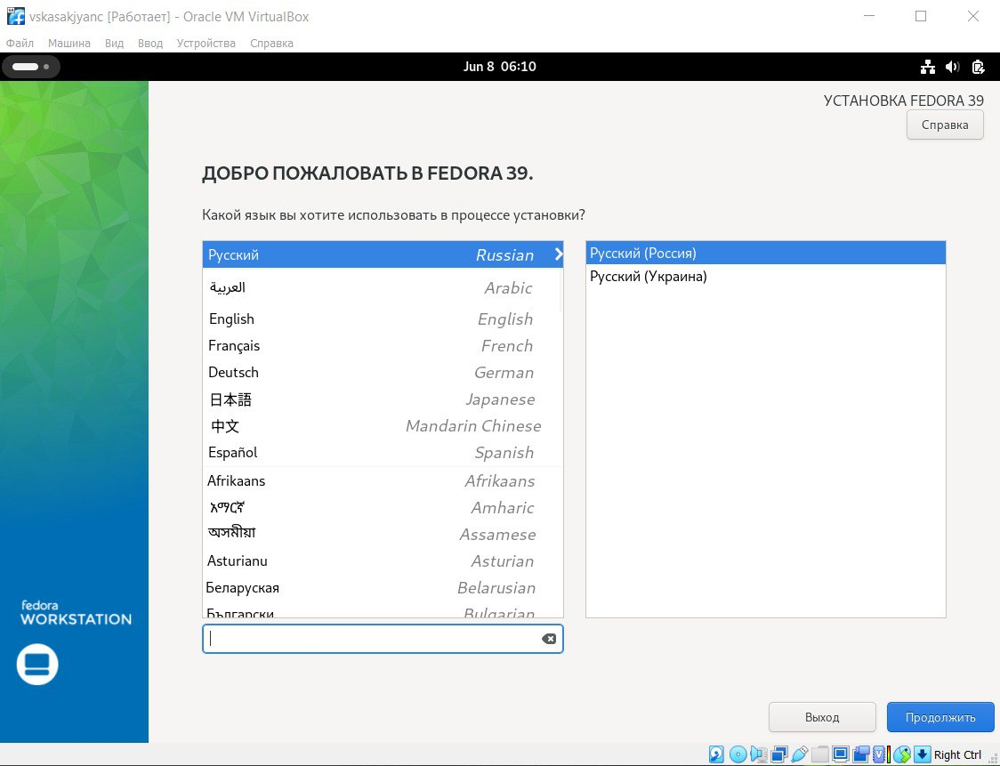{#fig:007 width=70%}

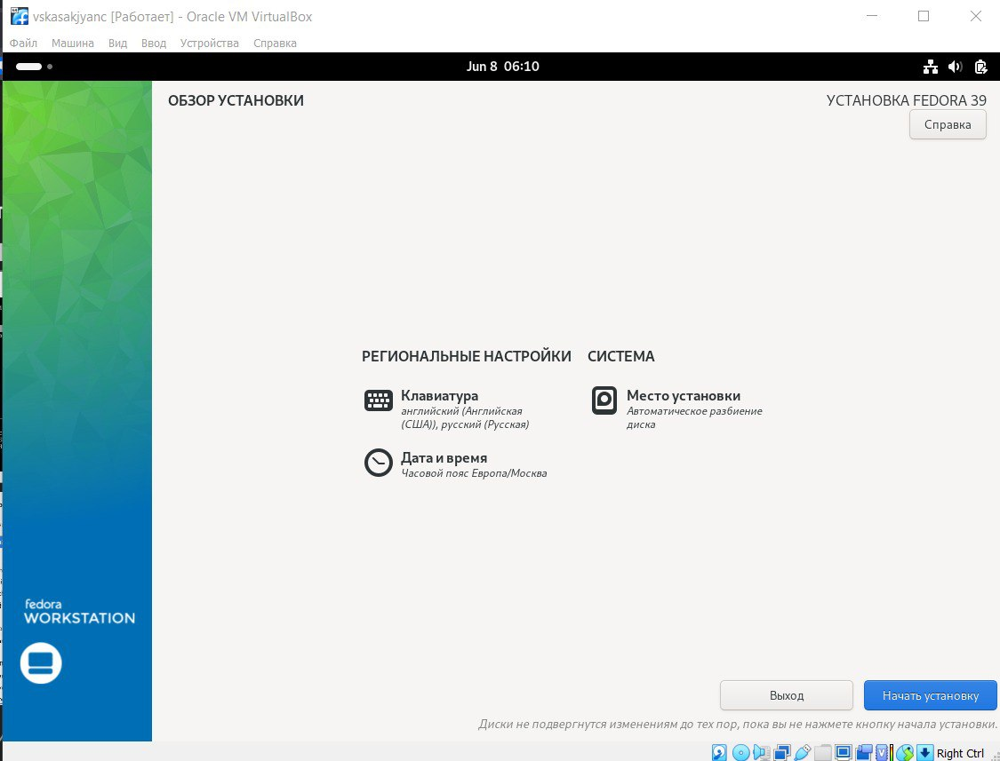{#fig:008 width=70%}

После окончания установки ОС выключаем виртуальную машину и изымаем ISO диск из привода (рис. [-@fig:009]). Вновь запускаем систему (рис. [-@fig:010]) и настраиваем .

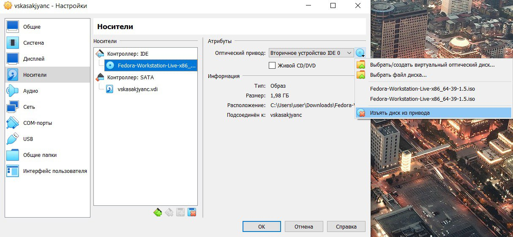{#fig:009 width=70%}

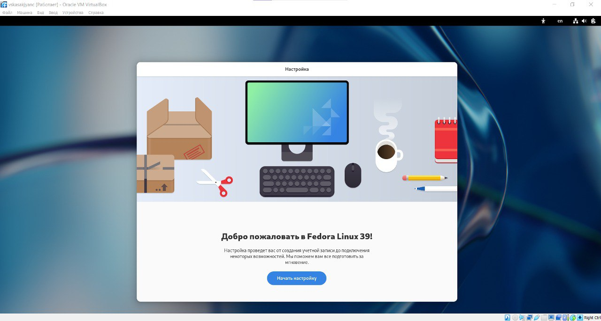{#fig:010 width=70%}

Далее в терминале переключаемся на роль супер-пользователя командой `sudo -i` и обновляем все пакеты с помощью `dnf -y update` (рис. [-@fig:011]).

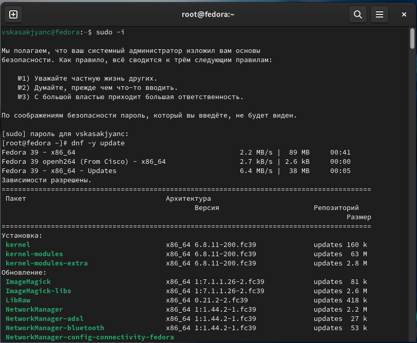{#fig:011 width=70%}

Для удобства работы устанавливаем MC (MidnightCommander) и tmux командой `dnf install tmux mc` (рис. [-@fig:012]).

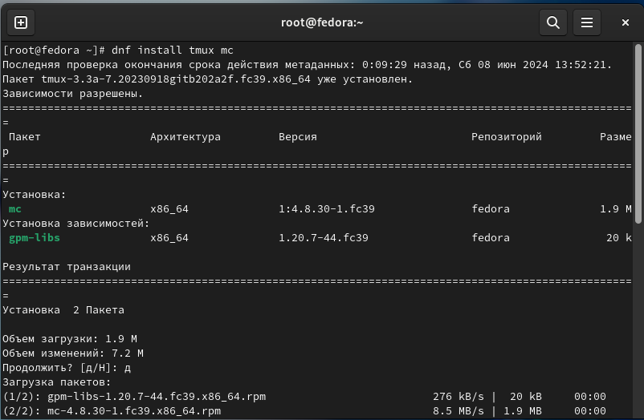{#fig:012 width=70%}

Также отключаем систему SELinux. Для этого переходим в mc, затем в файле /etc/selinux/config заменяем значение SELINUX=enforcing на значение SELINUX=permissive (рис. [-@fig:013]).

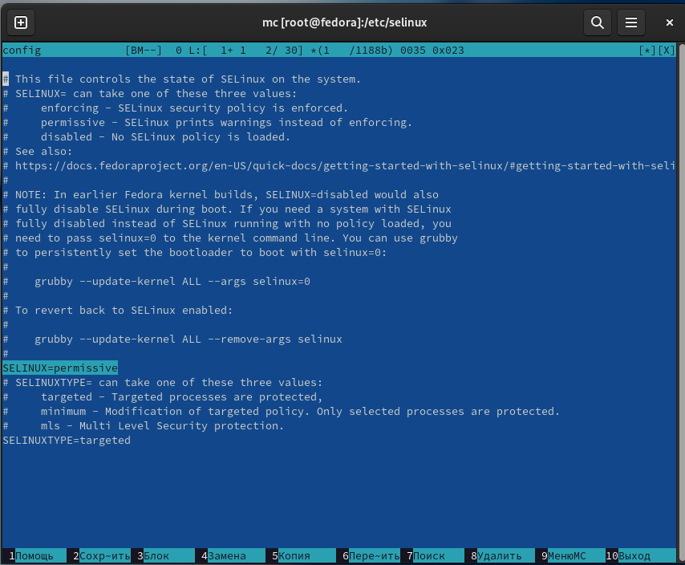{#fig:013 width=70%}

Далее установим имя хоста с помощью команды `hostnamectl set-hostname vskasakjyanc`, затем проверяем, установлено ли имя хоста верно командой `hostnamectl` (рис. [-@fig:014]).

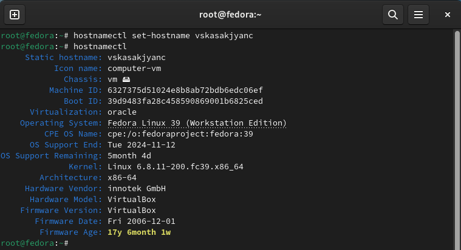{#fig:014 width=70%}

Также для дальнейшей работы нам необходимо установить pandoc и TexLive. Для этого в роли супер-пользователя вводим команды: `dnf -y install pandoc` (рис. [-@fig:015]) и `dnf -y install texlive-scheme-full` (рис. [-@fig:016]).

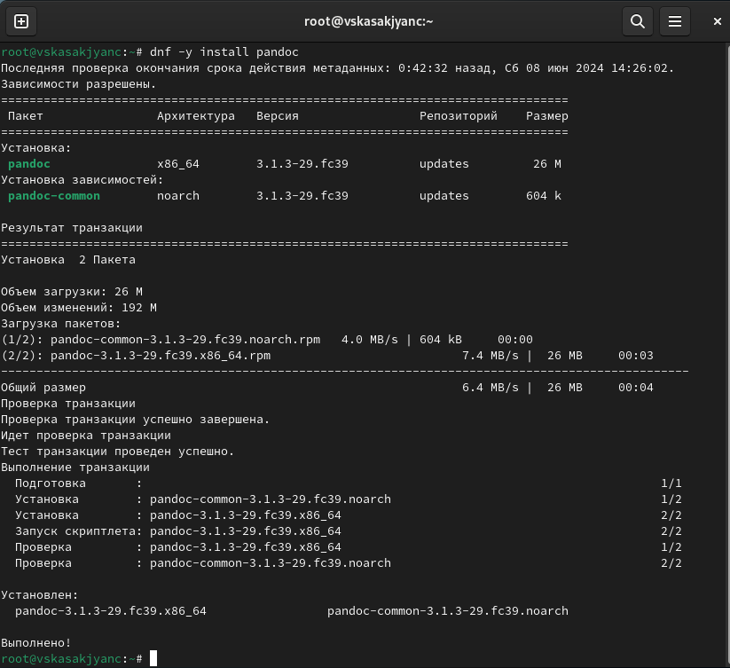{#fig:015 width=70%}

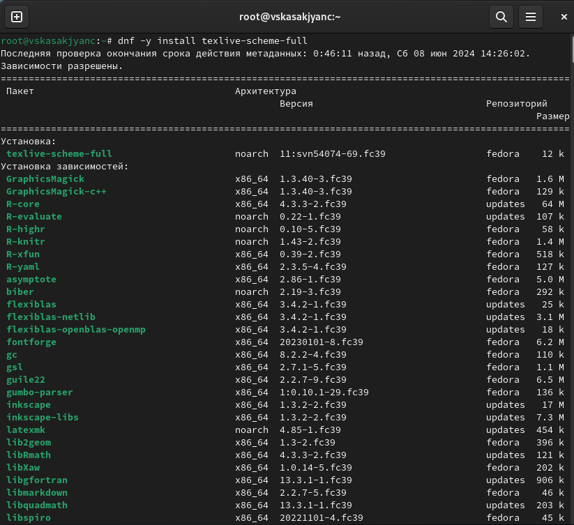{#fig:016 width=70%}

Установим пакет pandoc-crossref. Для этого узнаем установленную версию пакета pandoc, введя команду `pandoc --version`. Найдем подходящую версию pandoc [в github репозитории](https://github.com/lierdakil/pandoc-crossref/releases) и скачаем. Распакуем архив в директорию /usr/local/bin, добавим права на исполнение (рис. [-@fig:017]).

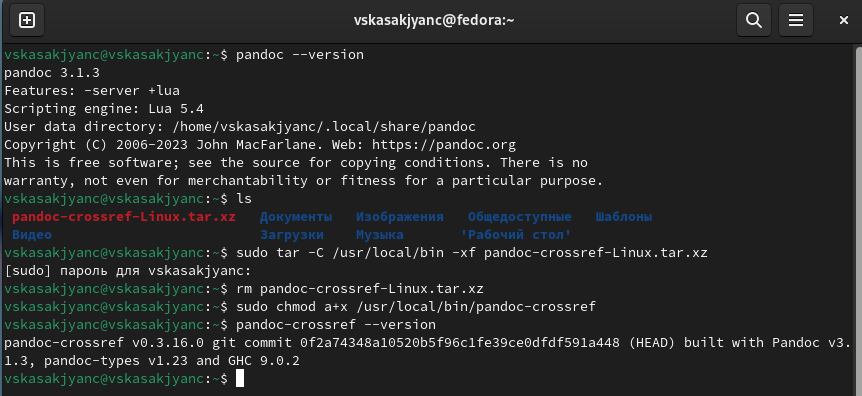{#fig:017 width=70%}

В окне терминала проанализируем последовательность загрузки системы, выполнив команду dmesg в роли супер-пользователя (рис. [-@fig:018]).

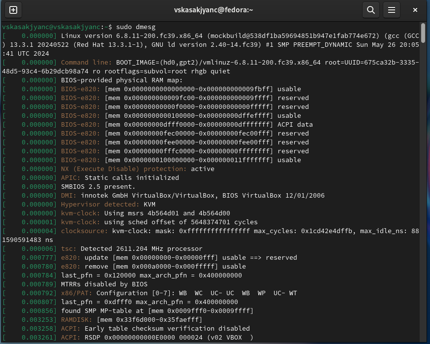{#fig:018 width=70%}

Получим следующую информацию :

1. Версия ядра Linux
2. Частота процессора
3. Модель процессора
4. Объем доступной оперативной памяти
5. Тип обнаруженного гипервизора
6. Тип файловой системы корневого раздела
7. Последовательность монтирования файловых систем (рис. [-@fig:019]).

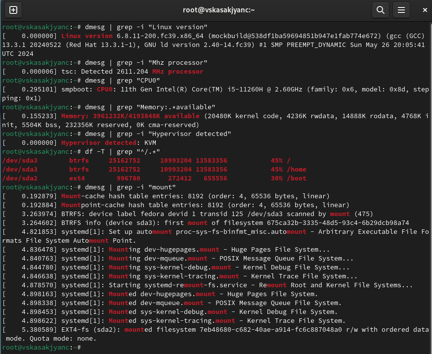{#fig:019 width=70%}

# Контрольные вопросы

1. **Какую информацию содержит учётная запись пользователя?**

Информацию об учетных записях Linux хранит в файле **/etc /passwd**.
    
Он содержит следующее:

**User ID** - логин;

**Password** – наличие пароля;

**UID** - идентификатор пользователя;

**GID** - идентификатор группы по умолчанию;

**User Info** – вспомогательная информация о пользователе (полное имя, контакты и т.д.)

**Home Dir** - начальный (он же домашний) каталог;

**Shell** - регистрационная оболочка, или shell.

2. **Укажите команды терминала и приведите примеры.**

* для получения справки по команде;
 
Для получения справки по команде используется команда "**man**" (от "manual"). Например, man ls

* для перемещения по файловой системе;
    
Для перемещения по файловой системе используется команда "**cd**" (от "change directory"). Например, cd /home/user/documents

* для просмотра содержимого каталога;
        
Для просмотра содержимого каталога используется команда "**ls**" (от "list"). Например, ls /home/user/documents

* для определения объёма каталога;
        
Для определения объёма каталога используется команда "**du**" (от "disk usage"). Например, du -h /path/to/directory

* для создания / удаления каталогов / файлов;
        
Для создания каталогов используется команда "**mkdir**" (от "make directory"), для удаления - "rmdir" (для удаления пустого каталога) или "rm" (для удаления файлов). Например, mkdir new_directory

* для задания определённых прав на файл / каталог;
        
Для задания определённых прав на файл / каталог используется команда "**chmod**" (от "change mode"). Например, chmod 755 file.txt

* для просмотра истории команд.
        
Для просмотра истории команд используется команда "**history**". Например, history

3. **Что такое файловая система? Приведите примеры с краткой характеристикой.**

Файловая система — это способ организации и хранения файлов на компьютере. Она определяет структуру файлов и директорий, права доступа к ним, их названия и другие свойства.
    
Примеры файловых систем в Linux:

**ext4** - одна из наиболее распространенных файловых систем в Linux. Она обладает высокой производительностью и поддерживает большие объемы данных.

**Btrfs** - современная файловая система, которая поддерживает различные функции, такие как снимки, управление памятью и проверка целостности данных.

**XFS** - файловая система, разработанная для обработки больших объемов данных и высоких нагрузок. Она обладает хорошей производительностью и отказоустойчивостью.

**ZFS** - файловая система с мощными функциями управления данными, включая сжатие, шифрование и быструю проверку целостности данных.

4. Как посмотреть, какие файловые системы подмонтированы в ОС?

В Linux можно просмотреть список подмонтированных файловых систем с помощью команды **df -h**. Эта команда отобразит информацию о дисковом пространстве, включая подмонтированные файловые системы. Также можно использовать команду **mount**, которая отобразит список всех подмонтированных файловых систем и их параметры.
    
5. **Как удалить зависший процесс?**

Для удаления зависшего процесса в Linux можно воспользоваться командой **kill**. Сначала необходимо определить PID (идентификатор процесса) зависшего процесса с помощью команды **ps -aux | grep [название процесса]**. Затем используйте команду **kill [PID]** для завершения процесса. Если процесс по-прежнему не завершается, можно попробовать использовать команду **kill -9 [PID]**, которая немедленно прерывает процесс. Также можно воспользоваться командой **pkill [название процесса]** для завершения всех процессов с указанным именем.

# Выводы

В данной работе мы приобрели практические навыки установки операционной системы на виртуальную машину и настройки минимально необходимых для дальнейшей работы сервисов.

# Список литературы{.unnumbered}

::: {#refs}
:::
