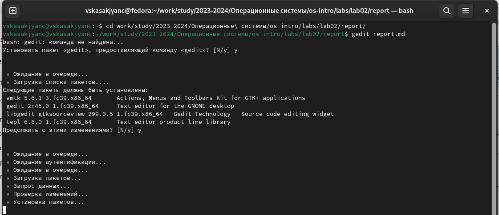
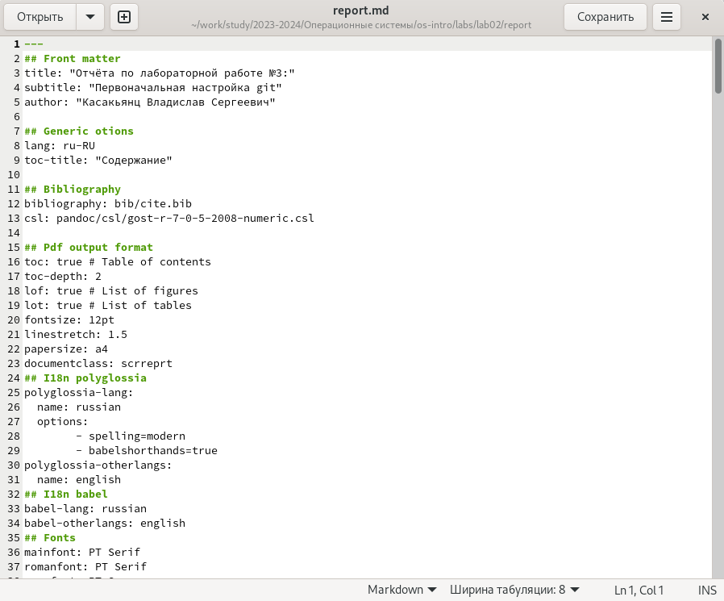
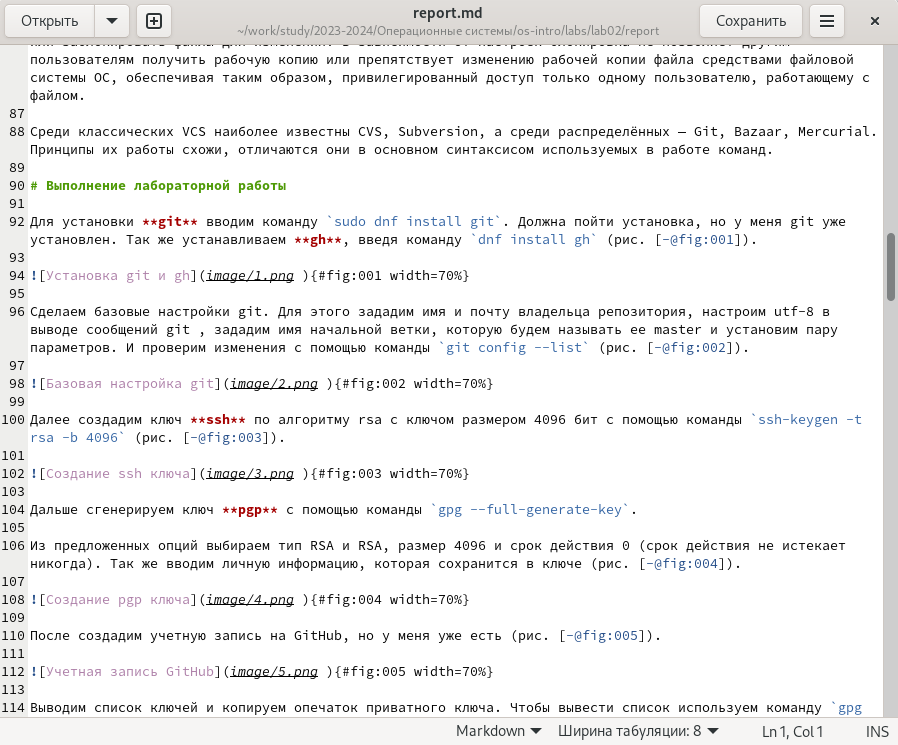
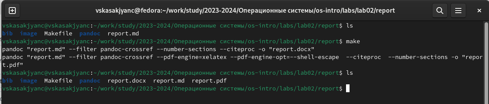
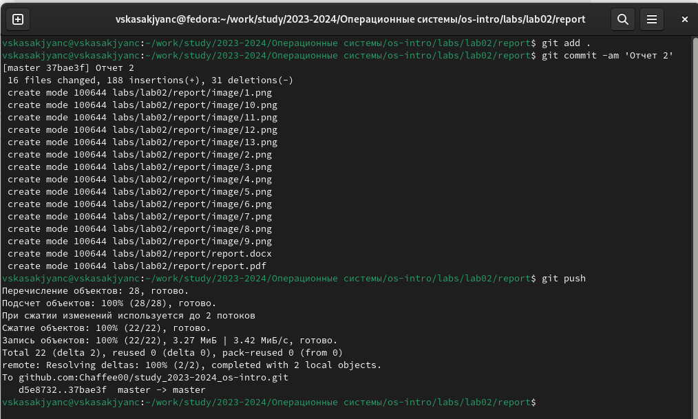

---
## Front matter
title: "Отчёт по лабораторной работе №3:"
subtitle: "Markdown"
author: "Касакьянц Владислав Сергеевич"

## Generic otions
lang: ru-RU
toc-title: "Содержание"

## Bibliography
bibliography: bib/cite.bib
csl: pandoc/csl/gost-r-7-0-5-2008-numeric.csl

## Pdf output format
toc: true # Table of contents
toc-depth: 2
lof: true # List of figures
fontsize: 12pt
linestretch: 1.5
papersize: a4
documentclass: scrreprt
## I18n polyglossia
polyglossia-lang:
  name: russian
  options:
	- spelling=modern
	- babelshorthands=true
polyglossia-otherlangs:
  name: english
## I18n babel
babel-lang: russian
babel-otherlangs: english
## Fonts
mainfont: PT Serif
romanfont: PT Serif
sansfont: PT Sans
monofont: PT Mono
mainfontoptions: Ligatures=TeX
romanfontoptions: Ligatures=TeX
sansfontoptions: Ligatures=TeX,Scale=MatchLowercase
monofontoptions: Scale=MatchLowercase,Scale=0.9
## Biblatex
biblatex: true
biblio-style: "gost-numeric"
biblatexoptions:
  - parentracker=true
  - backend=biber
  - hyperref=auto
  - language=auto
  - autolang=other*
  - citestyle=gost-numeric
## Pandoc-crossref LaTeX customization
figureTitle: "Рис."
tableTitle: "Таблица"
listingTitle: "Листинг"
lofTitle: "Список иллюстраций"
lolTitle: "Листинги"
## Misc options
indent: true
header-includes:
  - \usepackage{indentfirst}
  - \usepackage{float} # keep figures where there are in the text
  - \floatplacement{figure}{H} # keep figures where there are in the text
---

# Цель работы

Научиться оформлять отчёты с помощью легковесного языка разметки Markdown.

# Задание

1. Ознакомиться с синтаксисом языка разметки Markdown;

2. Узнать, как компилируются отчёты в различных форматах из исходного файла с расширением .md;

3. Сделайте отчёт по предыдущей лабораторной работе в формате Markdown
  
# Выполнение лабораторной работы

Для начала перейдем в каталог с лабораторной работой №2 командой `cd ~/work/study/2023-2024/Операционные системы/os-intro/labs/lab02/report`, затем командой `gedit report.md` откроем файл с отчетом, но поскольку его нет, то сначала установимс его (рис. [-@fig:001]).

{#fig:001 width=100%}

Вносим изменения в шаблон, заполнив своими данными: ФИО, номер ЛР, название ЛР (рис. [-@fig:002]). И приступаем непосредственно к отчету по выполненным в ходе ЛР действий и их описанию, используя базовые сведения из теоритической части ЛР №3 (рис. [-@fig:003]).

{#fig:002 width=100%}

{#fig:003 width=100%}

После завершения оформления отчета необходимо скомпилировать его с помощью команды `make`. Командой `ls` проверяем, появились ли файлы. Если при просмотре новых файлов что-то в них не устраивает, то командой `make clean` можно их удалить, чтоб в дальнейшем скомпилировать заново (рис. [-@fig:004]).
    
{#fig:004 width=100%}

Затем отправляем полученные файлы на GitHub посредством локального репозитория (рис. [-@fig:005]).

{#fig:005 width=100%}

# Выводы

В данной лабораторной работе мы познакомились с синтаксисом и научились оформлять файлы в формате Markdown.

# Список литературы{.unnumbered}

::: {#refs}
:::
