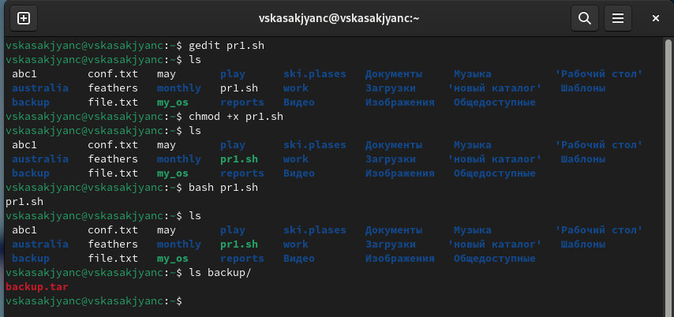
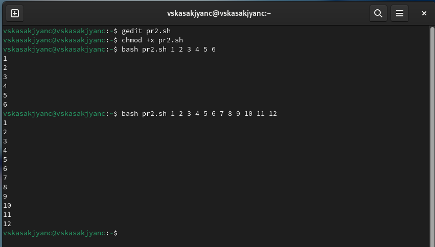
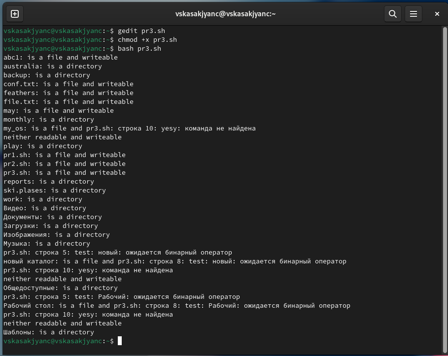

---
## Front matter
title: "Отчёт по лабораторной работе №9:"
subtitle: "Программирование в командном процессоре ОС UNIX. Командные файлы"
author: "Касакьянц Владислав Сергеевич"

## Generic otions
lang: ru-RU
toc-title: "Содержание"

## Bibliography
bibliography: bib/cite.bib
csl: pandoc/csl/gost-r-7-0-5-2008-numeric.csl

## Pdf output format
toc: true # Table of contents
toc-depth: 2
lof: true # List of figures
fontsize: 12pt
linestretch: 1.5
papersize: a4
documentclass: scrreprt
## I18n polyglossia
polyglossia-lang:
  name: russian
  options:
	- spelling=modern
	- babelshorthands=true
polyglossia-otherlangs:
  name: english
## I18n babel
babel-lang: russian
babel-otherlangs: english
## Fonts
mainfont: PT Serif
romanfont: PT Serif
sansfont: PT Sans
monofont: PT Mono
mainfontoptions: Ligatures=TeX
romanfontoptions: Ligatures=TeX
sansfontoptions: Ligatures=TeX,Scale=MatchLowercase
monofontoptions: Scale=MatchLowercase,Scale=0.9
## Biblatex
biblatex: true
biblio-style: "gost-numeric"
biblatexoptions:
  - parentracker=true
  - backend=biber
  - hyperref=auto
  - language=auto
  - autolang=other*
  - citestyle=gost-numeric
## Pandoc-crossref LaTeX customization
figureTitle: "Рис."
tableTitle: "Таблица"
listingTitle: "Листинг"
lofTitle: "Список иллюстраций"
lolTitle: "Листинги"
## Misc options
indent: true
header-includes:
  - \usepackage{indentfirst}
  - \usepackage{float} # keep figures where there are in the text
  - \floatplacement{figure}{H} # keep figures where there are in the text
---

# Цель работы

Изучить основы программирования в оболочке ОС UNIX/Linux. Научиться писать небольшие командные файлы.

# Задание

1. Написать скрипт, который при запуске будет делать резервную копию самого себя (то есть файла, в котором содержится его исходный код) в другую директорию backup в вашем домашнем каталоге. При этом файл должен архивироваться одним из архиваторов на выбор zip, bzip2 или tar. Способ использования команд архивации необходимо узнать, изучив справку.

2. Написать пример командного файла, обрабатывающего любое произвольное число аргументов командной строки, в том числе превышающее десять. Например, скрипт может последовательно распечатывать значения всех переданных аргументов.

3. Написать командный файл — аналог команды ls (без использования самой этой команды и команды dir). Требуется, чтобы он выдавал информацию о нужном каталоге и выводил информацию о возможностях доступа к файлам этого каталога.

4. Написать командный файл, который получает в качестве аргумента командной строки формат файла (.txt, .doc, .jpg, .pdf и т.д.) и вычисляет количество таких файлов в указанной директории. Путь к директории также передаётся в виде аргумента командной строки.

# Выполнение лабораторной работы

1. Напишем скрипт, который при запуске будет делать резервную копию самого себя в другую директорию backup в вашем домашнем каталоге. При этом файл должен архивироваться одним из архиваторов на выбор zip, bzip2 или tar (рис. [-@fig:001]): 

{#fig:001 width=100%}

Сделаем файл исполняемым с помощью и проверяем, сработал ли скрипт. На скриншоте можно увидеть, что все работает (рис. [-@fig:002]).

{#fig:002 width=100%}

2. Напишем пример командного файла, обрабатывающего любое произвольное число аргументов командной строки (рис. [-@fig:003]), (рис. [-@fig:004]).:

{#fig:003 width=100%}

{#fig:004 width=100%}

3. Напишем командный файл — аналог команды ls (без использования самой этой команды и команды dir), который выдавал информацию о нужном каталоге и выводил информацию о возможностях доступа к файлам этого каталога (рис. [-@fig:005]), (рис. [-@fig:006]):

{#fig:005 width=100%}
    
{#fig:006 width=100%}

4. Напишем командный файл, который получает в качестве аргумента командной строки формат файла (.txt, .doc, .jpg, .pdf и т.д.) и вычисляет количество таких файлов в указанной директории. Путь к директории также передаётся в виде аргумента командной строки. (рис. [-@fig:007]), (рис. [-@fig:008]):
 
{#fig:007 width=100%}
    
{#fig:008 width=100%}

# Контрольные вопросы

1. **Объясните понятие командной оболочки. Приведите примеры командных оболочек. Чем они отличаются?**

**Командная оболочка** – это интерфейс между пользователем и операционной системой, который позволяет пользователю взаимодействовать с операционной системой путем ввода текстовых команд. Примеры командных оболочек включают Bash (Bourne Again Shell), Zsh (Z Shell), Fish (Friendly Interactive Shell) и другие. Они отличаются по своим возможностям, синтаксису, встроенным функциям и поддерживаемым расширениям.

2. **Что такое POSIX?**

**POSIX** (Portable Operating System Interface) – это семейство стандартов, разработанных для обеспечения совместимости между различными операционными системами Unix. Он определяет общие интерфейсы для программирования на языке C, командной строки и управления файлами.


3. **Как определяются переменные и массивы в языке программирования bash?**

В языке программирования bash переменные определяются путем присваивания значений их именам. Например:

- Переменные: `variable_name=value`
- Массивы: `array_name[index]=value`

4. **Каково назначение операторов let и read?**

**Оператор let** используется для выполнения арифметических выражений в bash. **Оператор read** используется для считывания значений из стандартного ввода и присваивания их переменным.

5. **Какие арифметические операции можно применять в языке программирования bash?**

В языке программирования bash можно применять стандартные арифметические операции, такие как сложение, вычитание, умножение и деление.

6. **Что означает операция (( ))?**

Операция `(( ))` в bash используется для выполнения арифметических вычислений.

7. **Какие стандартные имена переменных Вам известны?**

Некоторые стандартные имена переменных в bash:

- `HOME`: домашний каталог текущего пользователя.
- `PWD`: текущий рабочий каталог.
- `PATH`: список каталогов, в которых операционная система ищет исполняемые файлы.
- `USER`: имя текущего пользователя.

8. **Что такое метасимволы?**

**Метасимволы** – это символы, которые имеют специальное значение в контексте командной строки или шаблонов файлов. Некоторые примеры метасимволов включают `*`, `?`, `[ ]`, `{ }`, `|`, `;` и `&`.

9. **Как экранировать метасимволы?**

Для экранирования метасимволов в bash используется обратная косая черта `\`. Например, чтобы использовать символ `*` как обычный символ, его можно экранировать так: `\*`.

10. **Как создавать и запускать командные файлы?**

Для создания и запуска командных файлов в bash можно использовать текстовый редактор для создания файла с расширением `.sh`, затем присвоить ему права на выполнение с помощью команды `chmod +x filename.sh`, и, наконец, запустить файл с помощью команды `./filename.sh`.

11. **Как определяются функции в языке программирования bash?**

Функции в языке программирования bash определяются с использованием ключевого слова `function` или просто с именем функции, после чего идет блок кода. Например:

``` bash
function my_function {
    # Код функции
    } 
```

12. **Каким образом можно выяснить, является файл каталогом или обычным файлом?**

Для определения, является ли файл каталогом или обычным файлом, можно использовать команду `test`. Например:

- Проверка на каталог: `test -d filename`
- Проверка на обычный файл: `test -f filename`

13. **Каково назначение команд set, typeset и unset?**

**Команды set, typeset и unset** используются для работы с переменными в bash:

- `set`: устанавливает значения и флаги для параметров командной строки.
- `typeset`: используется для объявления переменных с определенными свойствами, такими как readonly или integer.
- `unset`: удаляет значения переменных.

14. **Как передаются параметры в командные файлы?**

Параметры передаются в командные файлы в виде аргументов командной строки. Они доступны внутри скрипта через специальные переменные `$1`, `$2`, `$3` и так далее, где `$1` содержит первый аргумент, `$2` – второй и т.д.

15. **Назовите специальные переменные языка bash и их назначение.**

Некоторые специальные переменные языка bash и их назначение:

- `$0`: имя текущей выполняемой программы.
- `$#`: количество аргументов, переданных скрипту.
- `$?`: код возврата последней выполненной команды.
- `$$`: PID (идентификатор процесса) текущего скрипта.
- `$!`: PID последнего запущенного фонового процесса.

# Выводы

В данной лабораторной работе мы изучили основы программирования в оболочке ОС UNIX/Linux, а также научились писать небольшие командные файлы.

# Список литературы{.unnumbered}

::: {#refs}
:::
