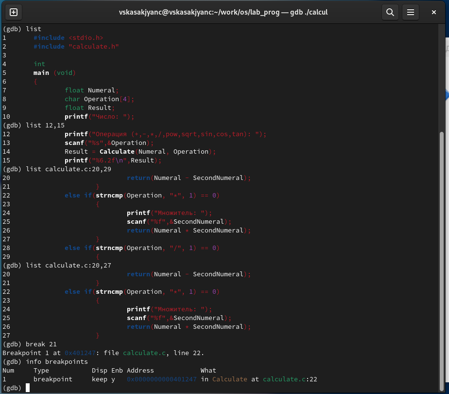

---
## Front matter
title: "Отчёт по лабораторной работе №12:"
subtitle: "Средства, применяемые при разработке программного обеспечения в ОС типа UNIX/Linux"
author: "Касакьянц Владислав Сергеевич"

## Generic otions
lang: ru-RU
toc-title: "Содержание"

## Bibliography
bibliography: bib/cite.bib
csl: pandoc/csl/gost-r-7-0-5-2008-numeric.csl

## Pdf output format
toc: true # Table of contents
toc-depth: 2
lof: true # List of figures
fontsize: 12pt
linestretch: 1.5
papersize: a4
documentclass: scrreprt
## I18n polyglossia
polyglossia-lang:
  name: russian
  options:
	- spelling=modern
	- babelshorthands=true
polyglossia-otherlangs:
  name: english
## I18n babel
babel-lang: russian
babel-otherlangs: english
## Fonts
mainfont: PT Serif
romanfont: PT Serif
sansfont: PT Sans
monofont: PT Mono
mainfontoptions: Ligatures=TeX
romanfontoptions: Ligatures=TeX
sansfontoptions: Ligatures=TeX,Scale=MatchLowercase
monofontoptions: Scale=MatchLowercase,Scale=0.9
## Biblatex
biblatex: true
biblio-style: "gost-numeric"
biblatexoptions:
  - parentracker=true
  - backend=biber
  - hyperref=auto
  - language=auto
  - autolang=other*
  - citestyle=gost-numeric
## Pandoc-crossref LaTeX customization
figureTitle: "Рис."
tableTitle: "Таблица"
listingTitle: "Листинг"
lofTitle: "Список иллюстраций"
lolTitle: "Листинги"
## Misc options
indent: true
header-includes:
  - \usepackage{indentfirst}
  - \usepackage{float} # keep figures where there are in the text
  - \floatplacement{figure}{H} # keep figures where there are in the text
---

# Цель работы

Приобрести простейшие навыки разработки, анализа, тестирования и отладки приложений в ОС типа UNIX/Linux на примере создания на языке программирования С калькулятора с простейшими функциями.

# Задание

1. В домашнем каталоге создайте подкаталог ~/work/os/lab_prog.

2. Создайте в нём файлы: calculate.h, calculate.c, main.c. Это будет примитивнейший калькулятор, способный складывать, вычитать, умножать и делить, возводить число в степень, брать квадратный корень, вычислять sin, cos, tan. При запуске он будет запрашивать первое число, операцию, второе число. После этого программа выведет результат и остановится.

3. Выполните компиляцию программы посредством gcc.

4. Создайте Makefile и поясните о его содержании.

5. С помощью gdb выполните отладку программы calcul (перед использованием gdb исправьте Makefile)

6. С помощью утилиты splint попробуйте проанализировать коды файлов calculate.c и main.c.

# Выполнение лабораторной работы

1. В домашнем каталоге создаю новый подкаталог ~/work/os/lab_prog, перехожу в него и создаю 3 файла: calculate.h, calculate.c, main.c (рис. [-@fig:001]):
	
{#fig:001 width=100%}

2. Запишем в файлы тексты программ, которые даны в лабораторной работе (рис. [-@fig:002]), (рис. [-@fig:003]), (рис. [-@fig:004]).

{#fig:002 width=100%}
    
{#fig:003 width=100%}

{#fig:004 width=100%}

3. Выполним компиляцию программы посредством gcc (рис. [-@fig:005]):

{#fig:005 width=100%}

4. Создим Makefile (рис. [-@fig:006]):
    
{#fig:006 width=100%}

5. Запустим отладчик GDB, загрузив в него программу для отладки. Запустим программу и посчитаем некое выражение (рис. [-@fig:007])

{#fig:007 width=100%}

Для постраничного (по 9 строк) просмотра исходного код используем команду list, затем для просмотра строк с 12 по 15 основного файла используем list 12,15, просмотрим определённых строк не основного файла, используя list calculate.c:20,29, а также установим точку останова в файле calculate.c на строке номер 21, использовав list calculate.c:20,27 и break 21 (рис. [-@fig:008]):
    
{#fig:008 width=100%}

Запустим программу внутри отладчика с помощью run и убедимся, что программа остановится в момент прохождения точки останова. С помощью команды backtrac покажим весь стек вызываемых функций от начала программы до текущего места. Посмотрим, чему равно на этом этапе значение переменной Numeral, введя print Numeral и сравним с результатом вывода на экран после использования команды, использовав display Numeral. Посмотрим, информацию про точку останова с помощью info breakpoints и удалим эту точку командой delete 1 (рис. [-@fig:009]):

{#fig:009 width=100%}

6. С помощью утилиты splint попробуйте проанализировать коды файлов main.c и calculate.c.

В файле main.c всего 3 предупреждения (рис. [-@fig:010]).
    
{#fig:010 width=100%}

А в файлу calculate.c всего 15 предупреждений (рис. [-@fig:011]).

{#fig:011 width=100%}

# Контрольные вопросы

1. Как получить информацию о возможностях программ gcc, make, gdb и др.?

Можно использовать `название_программы --help` для общей помощи, `man название_программы` для руководства пользователя или `info название_программы` для более подробной информации.

2. Назовите и дайте краткую характеристику основным этапам разработки приложений в UNIX.

- **Дизайн**: Определение требований и архитектуры системы.

- **Кодирование**: Написание исходного кода приложения.

- **Компиляция**: Преобразование исходного кода в исполняемый файл.

- **Тестирование**: Проверка функциональности и поиск ошибок.

- **Отладка**: Исправление обнаруженных ошибок.

- **Установка**: Размещение программы в системе для использования.

- **Сопровождение**: Обновление и улучшение программы.

3. Что такое суффикс в контексте языка программирования? Приведите примеры использования.

Суффикс — это расширение файла, указывающее на тип содержимого. Например, `.c` для исходных файлов C, `.h` для заголовочных файлов C.

4. Каково основное назначение компилятора языка С в UNIX?

Компилятор C преобразует исходный код на языке C в машинный код, который может выполняться операционной системой UNIX.

5. Для чего предназначена утилита make?

`make` автоматизирует процесс компиляции и сборки программы, используя файл `Makefile` для определения зависимостей между файлами и правил сборки.

6. Приведите пример структуры Makefile. Дайте характеристику основным элементам этого файла.

**Пример структуры Makefile**:

```makefile
   all: program

   program: main.o lib.o
       gcc -o program main.o lib.o

   main.o: main.c
       gcc -c main.c

   lib.o: lib.c
       gcc -c lib.c

   clean:
       rm -f *.o program
```
   
**Элементы Makefile**:

- **Цели**: `all`, `program`, `main.o`, `lib.o`, `clean`.

- **Зависимости**: Файлы, от которых зависит цель.

- **Правила**: Команды для создания цели из зависимостей.

- **Псевдоцели**: Цели, не связанные с файлами, например `clean`.

7. Назовите основное свойство, присущее всем программам отладки. Что необходимо сделать, чтобы его можно было использовать?

Возможность остановить выполнение программы, просмотреть и изменить значения переменных. Для использования требуется скомпилировать программу с опцией отладки (например, `gcc -g`).

8. Назовите и дайте основную характеристику основным командам отладчика gdb.

**Основные команды gdb**:

- `run`: Запуск программы.

- `break`: Установка точки останова.

- `next`: Выполнение следующей строки кода.

- `continue`: Продолжение выполнения до следующей точки останова.

- `print`: Вывод значения переменной.

- `quit`: Выход из gdb.

9. Опишите по шагам схему отладки программы, которую Вы использовали при выполнении лабораторной работы.

- Компиляция с опцией `-g`.

- Запуск gdb.

- Установка точек останова.

- Запуск программы с помощью `run`.

- Просмотр и изменение переменных.

- Продолжение выполнения и наблюдение за поведением программы.

10. Прокомментируйте реакцию компилятора на синтаксические ошибки в программе при его первом запуске.

Компилятор выдаст сообщения об ошибках, указывая местоположение и возможную причину ошибки.

11. Назовите основные средства, повышающие понимание исходного кода программы.

- Комментарии.

- Читаемые имена переменных и функций.

- Структурирование кода.

- Документация.

12. Каковы основные задачи, решаемые программой splint?

`splint` выполняет статический анализ кода на C для обнаружения ошибок программирования, уязвимостей безопасности и некачественного кода.


# Выводы

В данной лабораторной работе мы приобрели простейшие навыки разработки, анализа, тестирования и отладки приложений в ОС типа UNIX/Linux на примере создания на языке программирования С калькулятора с простейшими функциями.

# Список литературы{.unnumbered}

::: {#refs}
:::
